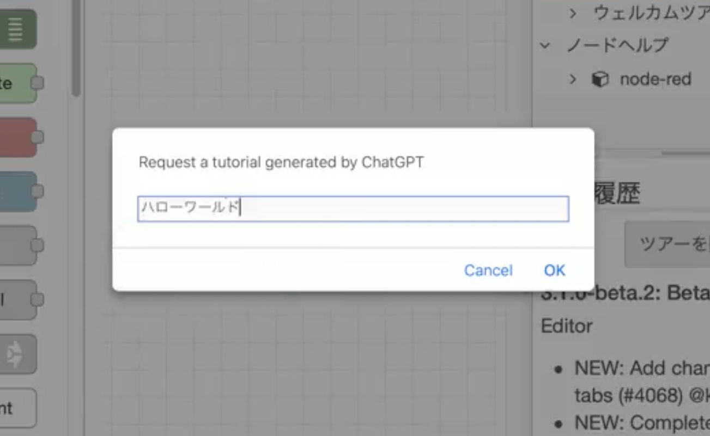
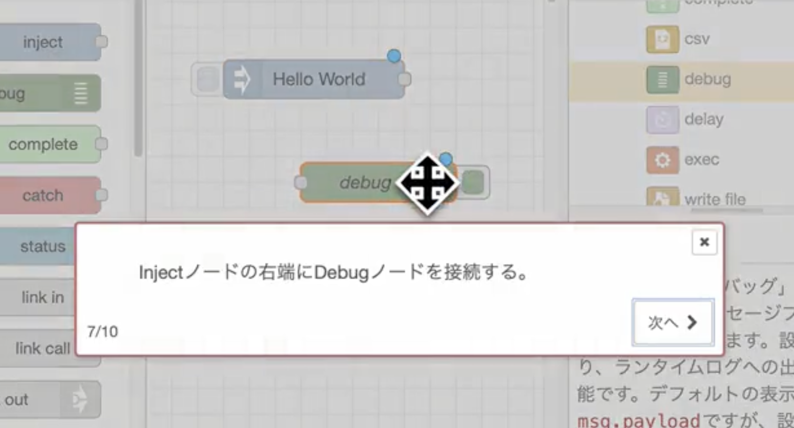
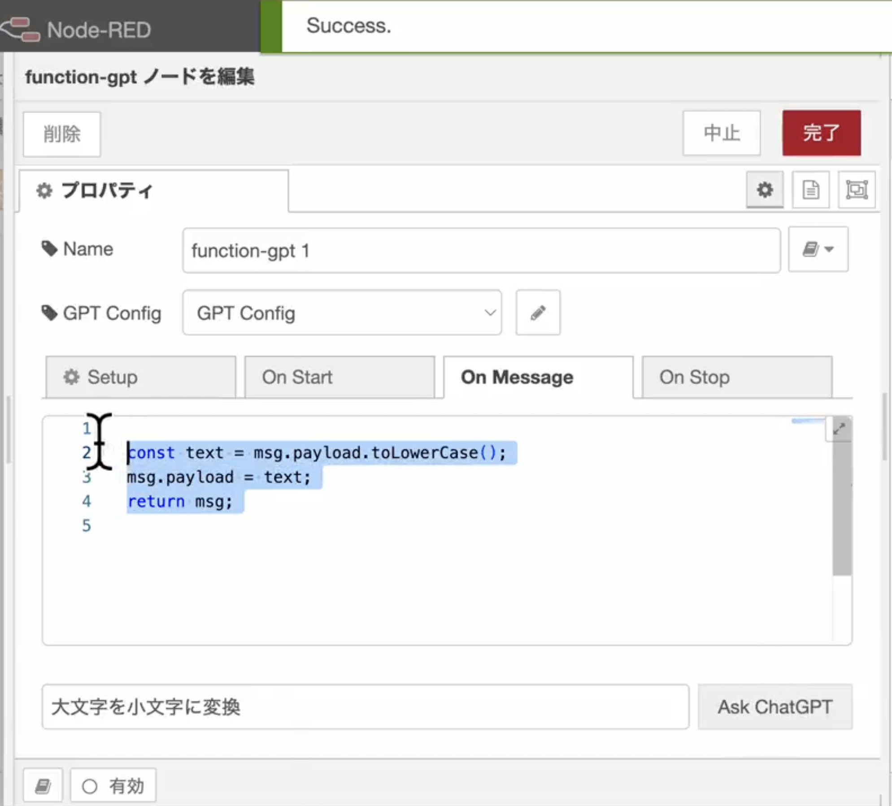

# ChatGPTでフロー開発を簡単に
2023年7月20日 横井一仁

https://kazuhitoyokoi.github.io/node-red-chatgpt

---
## 横井 一仁 (よこい かずひと)
- Node-RED開発メンバ
  - GitHubコミット数 世界3位
  - 和訳や不具合修正で貢献
- Node-RED User Group運営メンバ
  - Node-RED Con運営
  - UG Enterprise運営
- 日立製作所
  - ソリューションアーキテクト
  - DX、Industry 4.0研修講師

---
# 月刊I/Oの半年間の連載を完走しました🏃‍♀️💨📚
 - 3月号: プロジェクト機能の概要
 - 4月号: プロジェクトの切り替え
 - 5月号: フローのバージョン管理
 - 6月号: GitHubへフローを共有
 - 7月号: GitHubからフローを取得
 - 8月号: フローをクラウド環境へ 　 　　デプロイ

---
# 本日の内容
ChatGPT APIを活用したノードとプラグインを紹介
 - フローの作成手順のチュートリアル生成プラグイン
 - フローのドキュメントを生成するプラグイン
 - 文章からJavaScriptコードを生成できるfunctionノード

---
# ChatGPTでできること
Node-REDで活用できるChatGPTの機能
- 「作りたい物の説明文」から「フローのJSONデータ」を生成
- 「作りたい物の説明文」から「フローの作成手順」を生成
- 「フローのJSONデータ」から「フローの説明文」を生成
- 「フローのJSONデータ」からMermaid図を生成
- 「作りたい物の説明文」から「JavaScriptのコード」を生成

---
# フロー作成手順のチュートリアル生成プラグイン
開発したい物を入力するとエディタ上で開発手順を教えてくれるプラグイン

- ダイアログに作りたい物を入力しChatGPTで作成手順を生成
- ツアー機能を用いて、作成手順をステップバイステップで説明

https://twitter.com/kazuhitoyokoi/status/1647509785942827008

---
# フローのドキュメントを生成するプラグイン
開発したフローを説明する文章と図を 自動的に作成できるプラグイン

- フローの説明欄の下に「Ask ChatGPT」ボタンが追加される
- クリックすると、ChatGPTで生成した説明文を貼り付けてくれる

https://github.com/node-red-jp/node-red-contrib-plugin-chatgpt

---
# 文章からJavaScriptコードを生成できるfunctionノード
functionノードの仕様に沿ったJavaScriptコードを生成するノード

- 作成したい物を入力後、 「Ask ChatGPT」ボタンを押す
- ChatGPTが生成したJavaScript コードを貼り付けてくれる

https://twitter.com/kazuhitoyokoi/status/1653720620839104512

---
## 感想
ChatGPT活用によって初心者ユーザ、ITエンジニア、OTエンジニアの距離が近くなった

 - Node-REDの初心者ユーザが、自身でハンズオンできるように
 - ITエンジニアは、分かりやすいドキュメントを提供できるように
 - ノーコード開発をしていたOTエンジニアが、ローコードの領域に踏み込めるように

  
